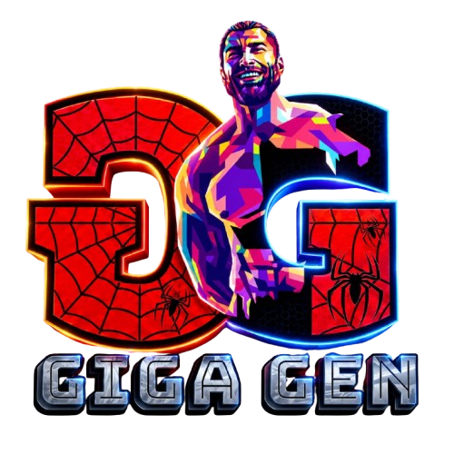

<p align="center">
  
</p>

<h1 align="center">GIGAGEN 4.0</h1>
<h3 align="center">Generative AI Treasure Hunt & Creative Quest</h3>

<p align="center">
  <em>An end-to-end continuous creative quest connecting narrative lore, visual comic design, generative video, and dynamic audio scoring.</em>
</p>

---

**GIGAGEN 4.0** is a Generative AI treasure-hunt competition where every challenge connects to the next. Instead of separate standalone rounds, participants embark on one continuous creative quest — from decoding clues to generating an original story, illustrating comic strips, producing dynamic generative video, and composing original music.

This repository catalogs the complete multimedia submissions across all stages of the creative pipeline.

---

## 🗺️ The Continuous Creative Quest Pipeline

Each phase of the quest builds directly on the previous one:


1. **Clue Decoding & Story Generation**: Unraveling narrative prompts and establishing the lore (Topics: *The Forgotten Temple*, *PRAN-YANTRA*, Problem Statement challenges).
2. **Visual & Comic Panels**: Crafting multi-page sequential comic art from the generated storylines.
3. **Generative Video & Motion**: Bringing the scenes and comic sequences to life with AI video generation.
4. **AI Soundtrack & Audio**: Scoring the adventure with original thematic music and sound design.

---

## 📁 Repository Structure

```text
GigaGen_4.0/
├── audio/                                      # Phase 4: Original Soundtrack & Audio Design
│   └── Fun In The Jungle _ Upbeat Jungle Music For Media _ Cheerful Tribal Theme - (320 Kbps).mp3
├── documents/                                  # Phase 1 & 2: Story & Comic Submissions (PDF)
│   ├── Document from Jai Sagulale__).pdf
│   ├── GIGAGEN_4.0_TheForgottenTemple_Comic by Kartik Barnalapdf.pdf
│   ├── kreatorsss.pdf
│   ├── PRAN-YANTRA by Mihir Dhanore(Topic 3).pdf
│   └── Team Codex Problem Statement 3.pdf
├── images/                                     # Phase 2: Brand Assets & Extracted Comic Panels
│   ├── gigagen_logo.png                        # Official GIGAGEN 4.0 Brand Logo (Transparent)
│   ├── Document_Jai_Sagulale/                  # 10 pages (JPG)
│   ├── PRAN_YANTRA/                           # 10 pages (PNG)
│   └── TheForgottenTemple_Comic/               # 10 pages (JPG)
├── videos/                                     # Phase 3: AI Video Generations (Git LFS)
│   ├── GigaGen Comic (Round 2 Aishwarya Lala Final Video).mp4
│   ├── Kartik Barnala (Topic 1) video.mp4      (132.89 MB - Git LFS)
│   ├── Mihir Dhanore (Topic 1) video.mp4       (183.73 MB - Git LFS)
│   └── Round 2 & 3 Submitted by Team Codex.mp4
├── .gitattributes                              # Git LFS tracking configuration for *.mp4
├── .gitignore                                  # Excludes raw archives & temporary files
└── README.md                                   # Project & quest documentation
```

---

## 📦 Media & Challenge Catalog

### 🎬 Videos (`videos/`)
> *Dynamic AI-generated video sequences developed from participant storylines and comic panels.*

| Submission / Participant | Topic / Round | File Size | Storage |
| :--- | :--- | :--- | :---: |
| **Kartik Barnala** | Topic 1 Video Submission | 132.89 MB | **Git LFS** |
| **Mihir Dhanore** | Topic 1 Video Submission | 183.73 MB | **Git LFS** |
| **Aishwarya Lala** | GigaGen Comic (Round 2 Final Video) | 9.90 MB | Git LFS |
| **Team Codex** | Round 2 & 3 Video Submission | 8.90 MB | Git LFS |

### 🎵 Audio & Original Music (`audio/`)
> *Original theme and background score composed to accompany the quest.*

| Track Title | Format | File Size | Description |
| :--- | :---: | :---: | :--- |
| **Fun In The Jungle** | MP3 (320 Kbps) | 8.53 MB | Cheerful tribal & jungle theme composed for media sequences |

### 📄 Comic & Quest Documents (`documents/`)
> *Complete PDF submissions including storyline comics, presentations, and problem statements.*

| Submission File | Submitter / Topic | Size |
| :--- | :--- | :---: |
| `GIGAGEN_4.0_TheForgottenTemple_Comic by Kartik Barnalapdf.pdf` | Kartik Barnala — *The Forgotten Temple* Comic | 5.27 MB |
| `PRAN-YANTRA by Mihir Dhanore(Topic 3).pdf` | Mihir Dhanore — *PRAN-YANTRA* (Topic 3) | 14.95 MB |
| `Document from Jai Sagulale__).pdf` | Jai Sagulale — Comic Submission | 2.28 MB |
| `Team Codex Problem Statement 3.pdf` | Team Codex — Problem Statement 3 | 19.00 MB |
| `kreatorsss.pdf` | Team Kreators Submission | 1.06 MB |

### 🖼️ Extracted Comic Panels & Brand Assets (`images/`)
> *Official transparent brand logo along with high-resolution panel extractions from comic submissions for easy previewing and asset reuse.*

- **`gigagen_logo.png`**: Official GIGAGEN 4.0 transparent vector-style logo
- **`TheForgottenTemple_Comic/`**: 10 pages (`kartik_comic_page_01.jpg` to `kartik_comic_page_10.jpg`)
- **`Document_Jai_Sagulale/`**: 10 pages (`jai_doc_page_01.jpg` to `jai_doc_page_10.jpg`)
- **`PRAN_YANTRA/`**: 10 pages (`pran_yantra_page_01.png` to `pran_yantra_page_10.png`)

---

## ⚙️ Git Large File Storage (Git LFS)

Because videos in this repository exceed GitHub's 100 MB single-file limitation, they are tracked via **Git LFS**:

```bash
# Clone the repository
git clone https://github.com/MeshramYug/GigaGen_4.0.git

# Pull all Large File Storage assets (videos)
cd GigaGen_4.0
git lfs pull
```
